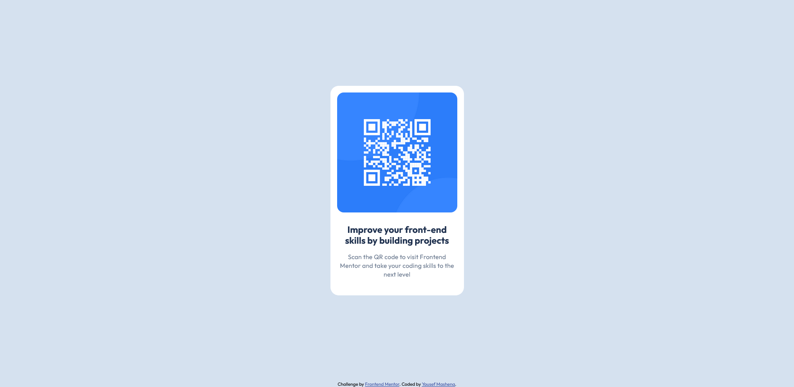

# Frontend Mentor - QR code component solution

This is a solution to the [QR code component challenge on Frontend Mentor](https://www.frontendmentor.io/challenges/qr-code-component-iux_sIO_H). Frontend Mentor challenges help you improve your coding skills by building realistic projects.

## Table of contents

- [Overview](#overview)
  - [Screenshot](#screenshot)
  - [Links](#links)
- [My process](#my-process)
  - [Built with](#built-with)
  - [What I learned](#what-i-learned)
  - [Continued development](#continued-development)
  - [Useful resources](#useful-resources)
- [Author](#author)

## Overview

### Screenshot



### Links

- Live Site URL: [https://yousef-mashena.github.io/qr-card-project/](https://yousef-mashena.github.io/qr-card-project/)

## My process

### Built with

- Semantic HTML5 markup
- CSS
- Flexbox

### What I learned

Understanding how setting margin to auto works especially for vertical centering.

```css
main {
  height: calc(100vh - 12px);
  display: flex;
}
/* Used margin:auto since there is only 1 flex item*/
.qr-card {
  max-width: 320px;
  margin: auto;
  background-color: #fff;
  border-radius: 1.25rem;
}
```

### Continued development

I excited to go deeper into the world of CSS and learn more about responsive layouts

### Useful resources

- [px to rem converter](https://nekocalc.com/px-to-rem-converter) - used to quickly figure out the correct rem values to use instead of px when refering to the figma document.
- [Google fonts](https://fonts.google.com/specimen/Outfit) - used to add the "Outfit" font as specified in the figma document

## Author

- Website - [Github](https://github.com/Yousef-Mashena)
- Frontend Mentor - [@Yousef-Mashena](https://www.frontendmentor.io/profile/Yousef-Mashena)
